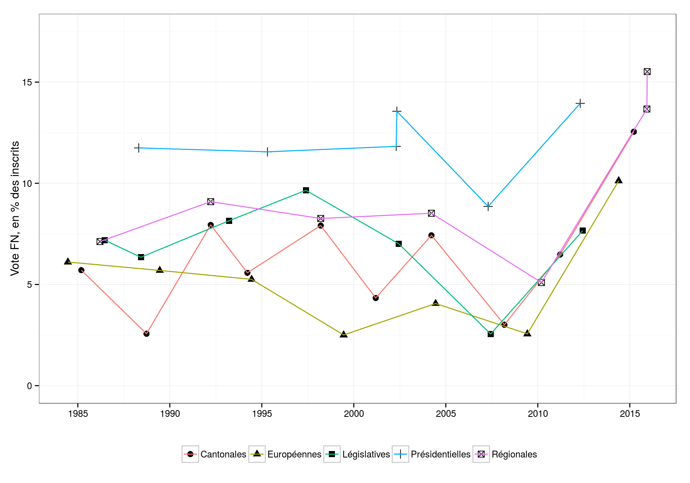
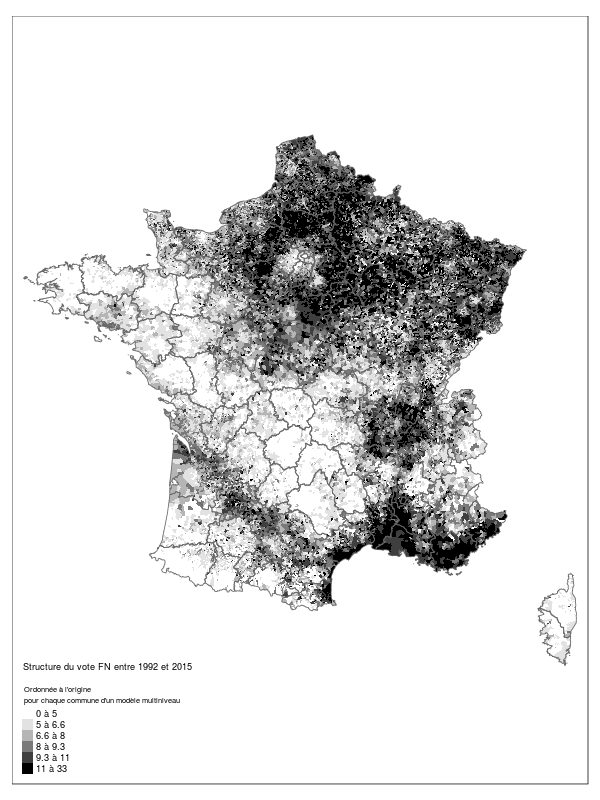
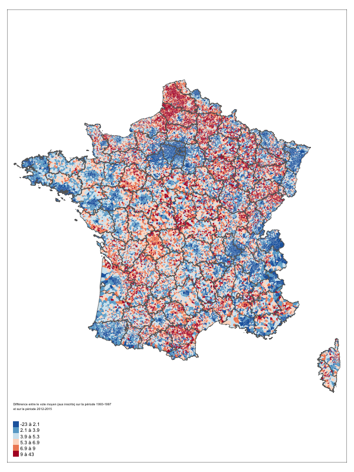
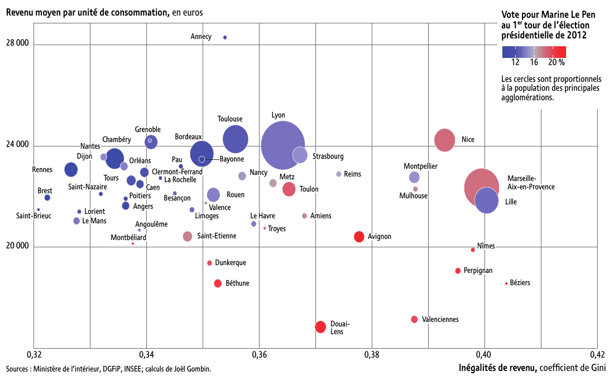
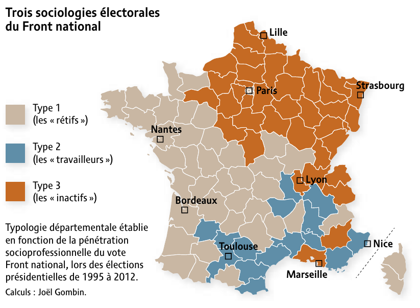
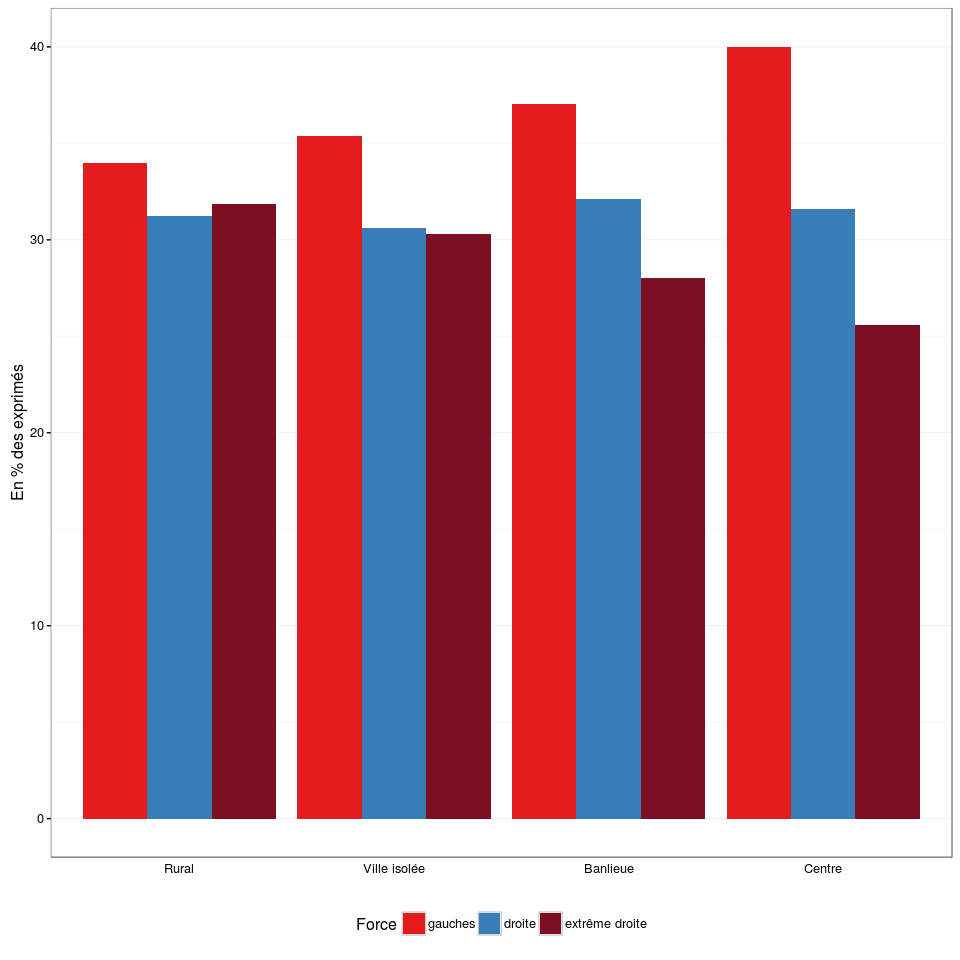

```{r setup, include=FALSE}
knitr::opts_chunk$set(echo = FALSE, 
                      message = FALSE, 
                      warning = FALSE, 
                      cache = TRUE, 
                      autodep = TRUE,
                      out.width = '800px',
                      out.height = '520px',
                      fig.width = 8,
                      fig.height = 5.2)
```


# Un niveau en nette augmentation

## Un niveau en nette augmentation {.flexbox .vcenter}

<center>
</img>
</center>

# Une structure géographique stable 

## Une structure géographique stable {.flexbox .vcenter}

<center>
</img>
</center>

## Un rééquilibrage géographique ? {.flexbox .vcenter}

<center>
</img>
</center>

## Un rééquilibrage géographique ? {.flexbox .vcenter}

<center>
</img>
</center>

## Une dimension centre-périphérie pas déterminante {.flexbox .vcenter}

<center>
</img>
</center>

## La géographie des inégalités {.flexbox .vcenter}

<center>
</img>
</center>

## Un, deux, trois électorats FN ? {.flexbox .vcenter}

<center>
<a href='https://www.monde-diplomatique.fr/2015/12/GOMBIN/54357'></img></a>
</center>


## Et aux régionales ? {.flexbox .vcenter}

<center>
</img>
</center>

## Et aux régionales ? {.flexbox .vcenter}

<center>
</img>
</center>


## Et aux régionales ? {.flexbox .vcenter}

<center>
</img>
</center>

# Merci !